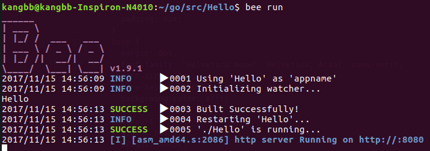

# 关于项目
这是一个beego项目的示例，每部分代码有详细的注释。<br/>
<br/>
之所以所则beego作为项目的开发框架，主要原因是：<br/>
1.beego框架开发比较简单，大大节省了开发的时间<br/>
2.beego可扩展性强，尤其对于一些大型项目，可以使用model减少开发难度<br/>
3.beego的抗压力能力比较强<br/>
4.开发webapi程序时比较方便<br/>
# 项目测试
运行：



使用curl测试：
```
kangbb@kangbb-Inspiron-N4010:~$ curl -v http://localhost:8080/user/?name=astaxie
*   Trying 127.0.0.1...
* TCP_NODELAY set
* Connected to localhost (127.0.0.1) port 8080 (#0)
> GET /user/?name=astaxie HTTP/1.1
> Host: localhost:8080
> User-Agent: curl/7.52.1
> Accept: */*
>
< HTTP/1.1 200 OK
< Content-Length: 533
< Content-Type: text/html; charset=utf-8
< Server: beegoServer:1.9.0
< Date: Wed, 15 Nov 2017 07:07:53 GMT
<
<!DOCTYPE html>

<html>
<head>
  <title>Hello</title>

  <style type="text/css">
    *,body {
      margin: 0px;
      padding: 0px;
    }
    body {
      margin: 0px;
      font-family: "Helvetica Neue", Helvetica, Arial, sans-serif;
      font-size: 30px;
      line-height: 40px;
      background-color: #fff;
    }
    .authour{
      width: 800px;
      height: 300px;
      margin:80px auto;
    }
  </style>
</head>

<body>
    <div class="author">
      Hello,astaxie</br>
      Nice to meet you!
    </div>
</body>
</html>
* Curl_http_done: called premature == 0
* Connection #0 to host localhost left intact

```
# 压力测试
安装apache2
```
$ sudo apt-get install apache2
```
查看用法
```
$ ab -h
```
对程序进行压力测试
```
$ ab -n 1000 -c 100 http://localhost:8080/user
This is ApacheBench, Version 2.3 <$Revision: 1757674 $>
Copyright 1996 Adam Twiss, Zeus Technology Ltd, http://www.zeustech.net/
Licensed to The Apache Software Foundation, http://www.apache.org/

Benchmarking localhost (be patient)
Completed 100 requests
Completed 200 requests
Completed 300 requests
Completed 400 requests
Completed 500 requests
Completed 600 requests
Completed 700 requests
Completed 800 requests
Completed 900 requests
Completed 1000 requests
Finished 1000 requests


Server Software:        beegoServer:1.9.0
Server Hostname:        localhost
Server Port:            8080

Document Path:          /user
Document Length:        12 bytes

Concurrency Level:      100
Time taken for tests:   0.114 seconds
Complete requests:      1000
Failed requests:        0
Total transferred:      156000 bytes
HTML transferred:       12000 bytes
Requests per second:    8741.41 [#/sec] (mean)
Time per request:       11.440 [ms] (mean)
Time per request:       0.114 [ms] (mean, across all concurrent requests)
Transfer rate:          1331.70 [Kbytes/sec] received

Connection Times (ms)
              min  mean[+/-sd] median   max
Connect:        0    2   1.1      2       5
Processing:     0    9   5.5      7      35
Waiting:        0    8   5.5      6      32
Total:          0   11   5.5     10      39

Percentage of the requests served within a certain time (ms)
  50%     10
  66%     11
  75%     13
  80%     14
  90%     18
  95%     21
  98%     27
  99%     30
 100%     39 (longest request)

```
相关参数解释(更多可使用命令 "ab -h" 查看)：
```
-n 执行的请求数量
-c 并发请求个数
```
测试结果解释：
```
Document Path:          /user  #请求的资源
Document Length:        12 bytes #服务器返回的文档的长度
Concurrency Level:      100  #并发个数
Time taken for tests:   0.114 seconds #完成所有请求的时间
Complete requests:      1000 #总请求个数
Failed requests:        0 #失败的请求个数
Total transferred:      156000 bytes #测试期间传输的总数据长度
HTML transferred:       12000 bytes #测试期间传输的HTML文档的长度
Requests per second:    8741.41 [#/sec] (mean) #平均每秒的请求个数
Time per request:       11.440 [ms] (mean) #平均每个请求消耗的时间
Transfer rate:          1331.70 [Kbytes/sec] received #传输速率

Percentage of the requests served within a certain time (ms)
  50%     10  #50%的请求都在10ms内完成，其余同
  66%     11
  75%     13
  80%     14
  90%     18
  95%     21
  98%     27
  99%     30
 100%     39 (longest request)
```