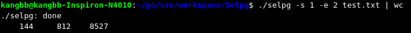

# 项目介绍
该项目包含三个文件：

>1.&emsp;selpg.go&emsp;&emsp;项目的源代码</br>
>2.&emsp;slepg&emsp;&emsp;selpg的可执行文件，使用 $go build selpg.go 命令即可</br>
>3.&emsp;test.txt&emsp;&emsp;测试文件。为了方便测试，文件中每5行添加了一个换页符号（txt文件不自动分页）</br>

项目默认测试文件名称、位置，如有需要，请自行修改。

# 命令介绍及测试
1.&nbsp;&nbsp;以下命令将把“input_file”的第 1 页写至标准输出（也就是屏幕），因为这里没有重定向或管道<font color="red">（默认72行为一页）</font>
```
$ ./selpg -s 1 -e 1 test.txt
```


2.&nbsp;&nbsp;以下命令与示例 1 所做的工作相同，但在本例中，selpg 读取标准输入，而标准输入已被 shell／内核重定向为来自“input_file”而不是显式命名的文件名参数。输入的第 1 页被写至屏幕。
```
$ ./selpg -s 1 -e 1 <test.txt
```


3.&nbsp;&nbsp;将命令"ps"的输出的第1页到第2页写至selpg的标准输出（屏幕）；当然，如果页数不在范围内，会输出错误日志；命令"ps"可以替换为任意其他linux行命令。
```
$ ps | ./selpg -s 1 -e 2
```


4.&nbsp;&nbsp;selpg 将第1页到第2页写至标准输出；标准输出被 shell／内核重定向至“out_test.txt”。
```
$ ./selpg -s 1 -e 1 test.txt >out_test.txt
```


5.&nbsp;&nbsp;selpg将第1页到第2页写至标准输出（屏幕）；所有的错误消息被 shell／内核重定向至“error.txt”
```
$ ./selpg -s 1 -e 1 test.txt 2>error.txt
```


6.&nbsp;&nbsp;selpg将第15页到第16页写至标准输出，标准输出被重定向至“out_test.txt”；selpg写至标准错误的所有内容都被重定向至“error.txt”
```
$ ./selpg -s 15 -e 16 test.txt >out_test.txt 2>error.txt
```


7.&nbsp;&nbsp;selpg将第15页到第16页写至标准输出，标准输出被重定向至“out_test.txt”；selpg 写至标准错误的所有内容都被重定向至 /dev/null（空设备），这意味着错误消息被丢弃了。
```
$ ./selpg -s 15 -e 16 test.txt >out_test.txt 2>/dev/null
```


8.&nbsp;&nbsp;selpg将第16页到第18页写至标准输出，标准输出被丢弃；错误消息在屏幕出现。
```
$ ./selpg -s 16 -e 18 test.txt >/dev/null
```


9.&nbsp;&nbsp;selpg的标准输出透明地被 shell／内核重定向，成为“wc”的标准输入，它会显示选定范围的页中包含的行数、字数和字符数。错误消息仍在屏幕显示。
```
$ ./selpg -s 1 -e 2 test.txt | wc
```


10.&nbsp;&nbsp;与上面的示例 9 相似，只有一点不同：错误消息被写至“error.txt”。
```
$ ./selpg -s 1 -e 2 test.txt 2>error.txt | wc
```


11.&nbsp;&nbsp;该命令将页长设置为5行，selpg可以把输入当作被定界为该长度的页那样处理，并将第1页至第2页输出到屏幕。
```
$ ./selpg -s 1 -e 2 -l 5 test.txt
```


12.&nbsp;&nbsp;假定页由换页符定界。第3页到第5页被写至 selpg的标准输出（屏幕）<font color="red">（文档每5行一个换页符）</font>
```
$ ./selpg -s 3 -e 5 -f test.txt
```


13.&nbsp;&nbsp;selpg将第10页到第20页由管道输送至命令“lp -dlp1”，该命令将使输出在打印机lp1上打印。
```
$ ./selpg -s 10 -e 20 -d lp1 test.txt
```


14.&nbsp;&nbsp;该命令利用了 Linux 的一个强大特性，即：在“后台”运行进程的能力。他会显示该进程的pid，然后立刻显示出shell提示符（如果进程完成时间较短，会显示出进程状态，再显示shell提示符）
```
$ ./selpg -s 3 -e 5  test.txt >out_test.txt 2>error.txt  &
```


以上是对本项目的所有介绍，如有不懂，请与作者联系。<br>
项目参考：[https://www.ibm.com/developerworks/cn/linux/shell/clutil/index.html](https://www.ibm.com/developerworks/cn/linux/shell/clutil/index.html)
